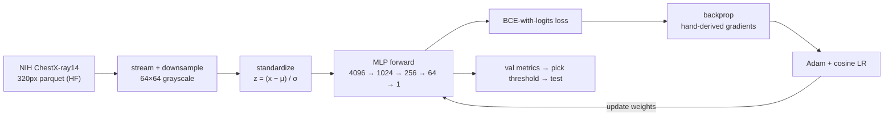

# chexvision-mini

A **true from-scratch neural network in pure NumPy** — every forward pass *and*
every gradient is derived and coded by hand, with **no autograd and no deep-
learning framework**. Companion to the
[CheXVision](https://github.com/arudaev/chexvision) chest X-ray project.

Where CheXVision uses PyTorch (a custom CNN and a DenseNet-121 transfer model),
this repo implements the underlying mathematics directly — forward propagation,
backpropagation, optimizers, and regularisation — to *demonstrate understanding
of the fundamentals*. It follows the structure of the *Neural Networks from
Scratch in Python* (NNFS) book and the "Deep Learning & Big Data" syllabus.

**What it does, in one sentence:** take a chest X-ray, shrink it to 64×64
grayscale, flatten it to 4096 numbers, push it through a small fully-connected
network, and output one number — the probability the X-ray is *abnormal*.



---

<details>
<summary><b>📖 Reading guide — learn the whole codebase in one sitting (click to expand)</b></summary>

<br>

You can understand this whole codebase in one sitting if you read the files in
the order below. Each step is one concept, in plain language, with the exact file
and function to open. The order is *how a neural network actually works*, which
is also the NNFS learning order.

> **TL;DR first sitting:** read `layers.py` → `losses.py` → `network.py` →
> `gradcheck.py`, then run `pytest tests/ -v`, then read `train.py`. That's the
> core idea (forward, error, backprop, proof, training loop). Everything else is
> supporting machinery.

### Step 1 — A neuron and a layer · `chexvision_mini/layers.py`
A **neuron** multiplies each input by a **weight**, adds them up, and adds a
**bias**. A **Linear (dense) layer** does that for many neurons at once, which is
just one matrix multiply: `output = x @ W + b`.
- `Linear.forward` — the matrix multiply.
- `ReLU.forward` — keeps positive values, zeroes negatives. This **non-linearity**
  is what lets a network model curves instead of just straight lines.
- `Sigmoid.forward` — squashes any number into (0, 1), i.e. a **probability**.
- *Why "He init"?* weights start as small random numbers scaled for ReLU so the
  signal neither vanishes nor explodes as it flows through layers.

### Step 2 — Measuring error · `chexvision_mini/losses.py`
The **loss** is a single number: how wrong the prediction is (lower = better).
For a yes/no task we use **binary cross-entropy (BCE)**. We compute it directly
from the raw output (the "logit", before sigmoid) for numerical stability — hence
**BCE-with-logits**.
- `BCEWithLogitsLoss.forward` — the loss value.
- `BCEWithLogitsLoss.backward` — the gradient `(sigmoid(z) − y) / N`: the first
  push that tells the network how to change its output to reduce error.

### Step 3 — Learning: backpropagation · `layers.py` (backward) + `network.py`
To improve, we need to know how *each weight* affects the loss. That's the
**chain rule**: walk backwards through the network, multiplying local gradients.
- `Linear.backward` — the three core formulas: `dW = xᵀ·dout`, `db = Σ dout`,
  `dx = dout·Wᵀ` (gradient for this layer's weights, its bias, and what to hand
  to the previous layer).
- `ReLU.backward` — gradient flows only where the input was positive.
- `Sequential.forward` / `Sequential.backward` — runs layers in order, then in
  **reverse** for the backward pass. This is backpropagation in 5 lines.

### Step 4 — Proving the gradients are correct · `chexvision_mini/gradcheck.py`
How do we know the hand-derived gradients are right? **Gradient checking.** Nudge
a weight up and down by a tiny ε, see how the loss changes (the *numerical*
gradient), and compare to our *analytic* gradient. If they match to ~1e-6, the
backprop is correct. This is the single most important test in the project.
- `gradient_check` — the comparison.
- `tests/test_chexvision_mini.py::test_gradient_check_passes` — the assertion.

### Step 5 — Updating the weights · `chexvision_mini/optim.py`
Now that we have gradients, **optimizers** decide how to step.
- `SGD` — move each weight a small step *opposite* its gradient (step size =
  learning rate); optional **momentum** smooths the steps.
- `RMSProp` — scales the step per-weight by recent gradient size.
- `Adam` — momentum + RMSProp + bias correction; our default.

### Step 6 — Not memorising the data · `chexvision_mini/regularizers.py`
A model can **overfit** (ace the training data, fail on new data).
- `Dropout` — randomly silences neurons during training so the net can't rely on
  any single one (a no-op at inference).
- `l1_penalty` / `l2_penalty` — discourage large weights. (L2 is wired into the
  optimizers as "weight decay", on weights only.)

### Step 7 — Getting the X-rays in · `chexvision_mini/data.py` + `augment.py`
- `load_xray_subset` — three modes: `synthetic` (offline, no network),
  `local` (streams a few hundred real images from Hugging Face), `kaggle`
  (larger subset for the cloud run). It never downloads the full ~8 GB dataset —
  it **streams** and downsamples on the fly.
- `binary_label` — label is 0 (*normal*) when the finding is "No Finding", else 1.
- `augment_batch` — small, label-preserving image tweaks (horizontal flip, noise,
  brightness) that improve generalisation.

### Step 8 — Putting it all together · `chexvision_mini/train.py`  ← the spine
Read `train()` top to bottom; it ties every previous step together:
1. **Standardise** inputs (subtract mean, divide by std — stats from train only).
2. For each **epoch**: shuffle, loop **mini-batches** → forward → loss → backward
   → `optimizer.step()`.
3. **Cosine learning-rate decay** over the run.
4. Track **validation AUC** each epoch and keep the **best** checkpoint (the last
   epoch is usually overfit).
5. After training: pick a **decision threshold** on validation, then evaluate the
   **untouched test split** once, and save all artifacts.

### Step 9 — Scoring · `chexvision_mini/metrics.py`
- `evaluation_report` — accuracy, **ROC-AUC** (threshold-independent ranking
  quality — our headline metric), precision/recall/F1, confusion matrix, ROC/PR
  curves.
- `best_threshold` — picks the operating point (Youden's J) on validation,
  because the default 0.5 is wrong when the classes aren't 50/50.

### Step 10 — Using the trained model · `chexvision_mini/inference.py`
- `load_checkpoint` — rebuild the network and load saved weights + normalisation.
- `predict_label` — preprocess a new image *exactly like training*, return
  P(abnormal) and a label. CLI: `python -m chexvision_mini predict --checkpoint artifacts --image xray.png`.

### Reference
- `config.yaml` — every hyperparameter (architecture, optimizer, LR, epochs,
  per-mode sample counts).
- `card.py` — renders the Hugging Face model card from the results.
- `docs/nnfs_alignment.md` — maps each NNFS book chapter to the file above.

</details>

---

## Repo map

| Path | Role |
|---|---|
| `chexvision_mini/layers.py` | Linear / ReLU / Sigmoid — forward & backward |
| `chexvision_mini/losses.py` | BCE-with-logits + stable sigmoid |
| `chexvision_mini/network.py` | `Sequential` container; save/load state |
| `chexvision_mini/gradcheck.py` | finite-difference gradient check |
| `chexvision_mini/optim.py` | SGD / RMSProp / Adam |
| `chexvision_mini/regularizers.py` | Dropout + L1/L2 |
| `chexvision_mini/data.py` | streaming loader (synthetic/local/kaggle) |
| `chexvision_mini/augment.py` | NumPy image augmentation |
| `chexvision_mini/train.py` | training loop, threshold, test eval, artifacts |
| `chexvision_mini/metrics.py` | metrics + threshold selection |
| `chexvision_mini/inference.py` | load checkpoint + predict on a new image |
| `tests/` | gradient check, layer/shape, optimizer-overfit, threshold |
| `docs/` | concept docs, figure briefs, references |

## Results

Trained on a Kaggle CPU kernel. The checkpoint, metrics, and ROC/PR curves are
published to
[`arudaev/chexvision-mini`](https://huggingface.co/arudaev/chexvision-mini)
(`metrics.json` reports **test** metrics at a validation-chosen threshold, plus
validation for model selection).

> This is a *fundamentals demonstration*. As an MLP on 64×64 pixels (no
> convolution) it does **not** reproduce CheXVision's headline numbers (DenseNet
> binary AUC ≈ 0.787) — that is the PyTorch models' job. The value here is
> transparent, hand-written math with a gradient-check proof, honest evaluation
> on an untouched test split, and a working inference path.

## Quickstart

```bash
pip install -e ".[dev]"

python -m chexvision_mini --mode synthetic   # offline smoke test (no network)
python -m chexvision_mini --mode local       # streams a few hundred real images from HF
pytest tests/ -v                             # gradient check + training tests

python -m chexvision_mini predict --checkpoint artifacts --image xray.png
```

## Run modes

There are two independent axes: the `--mode` flag (which **data**) and **where**
the code runs. All three use the same `train.py` pipeline — pure NumPy, CPU-only;
only the data source, size, and machine differ.

| | `--mode synthetic` | `--mode local` | Kaggle dispatch (`--mode kaggle`) |
|---|---|---|---|
| **Runs on** | your machine | your machine | Kaggle's CPU kernel (remote) |
| **Data** | fake, generated in NumPy | **real** X-rays, streamed from HF | **real** X-rays, streamed from HF |
| **Network needed?** | no (fully offline) | yes (HF streaming) | yes (inside the kernel) |
| **Size** (train/val/test) | 512 / 256 / 256 | 600 / 300 / 300 | 60k / 10k / 10k |
| **Epochs** | 15 | 12 | 200 |
| **Time** | seconds | a few minutes | ~4 hours |
| **Uploads to HF?** | no (writes `artifacts/`) | no (writes `artifacts/`) | **yes** → `arudaev/chexvision-mini` |
| **Results meaningful?** | no — random data | weak (tiny subset) | **yes — the reportable run** |

- **synthetic** — offline **smoke test**: a made-up but learnable problem that
  proves the whole pipeline runs end to end in seconds. Numbers are meaningless.
- **local** — real-data **sanity check** on your laptop: streams a few hundred
  real images (never the full ~8 GB), confirms the net learns real signal.
- **Kaggle dispatch** — the **actual training run** (`scripts/dispatch.py kaggle
  push numpy` in the parent repo): 60k images, 200 epochs, ~4h, then uploads the
  checkpoint + metrics + model card to HF. This is where the headline AUC ≈ 0.70
  comes from. `--mode kaggle` *could* run locally, but it would stream 60k images
  and grind for hours — that's why it goes to Kaggle. Only this run touches HF.

## Compute

Pure NumPy, **CPU-only** (no GPU — by design). The whole pipeline runs the same
locally and on a Kaggle CPU kernel; cloud dispatch lives in the parent CheXVision
repo (see the parent repository's development guide).

## License

MIT (code). The NNFS reference PDF under `docs/references/` is the authors'
copyrighted work, included here for coursework reference only.
