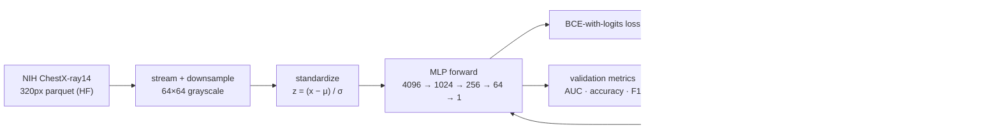
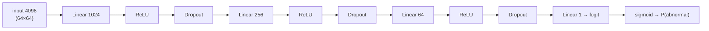

# chexvision-mini

A **true from-scratch neural network in pure NumPy** — every forward and backward
pass is derived and coded by hand, with no autograd. Companion to the
[CheXVision](https://github.com/arudaev/chexvision) chest X-ray project.

Where CheXVision uses PyTorch (a custom CNN and a DenseNet-121 transfer model),
this repo implements the underlying mathematics directly — backpropagation,
optimizers, and regularisation — to demonstrate understanding of the
fundamentals (the goal of the "Deep Learning and Big Data" course, following the
*Neural Networks from Scratch in Python* book).

## Pipeline



## Architecture



## What's inside

- **Layers** (`Linear`, `ReLU`, `Sigmoid`) with explicit `forward`/`backward`.
- **Loss**: numerically stable binary cross-entropy on logits (fused sigmoid).
- **Optimizers**: SGD + momentum and Adam, hand-coded; cosine LR decay.
- **Regularisation**: inverted dropout, L2 penalty, per-feature standardisation.
- **Gradient checking**: finite differences confirm the hand-derived gradients
  match to a relative error below 1e-6 — the correctness proof for the backprop.
- **Augmentation**: horizontal flip, Gaussian noise, brightness — in NumPy.
- **Task**: binary *normal vs abnormal* on the NIH ChestX-ray14 data
  (`arudaev/chest-xray-14-320`), downsampled to 64×64 grayscale.

## Results

Trained on a Kaggle CPU kernel; metrics, ROC/PR curves, and the trained
checkpoint are published to
[`arudaev/chexvision-mini`](https://huggingface.co/arudaev/chexvision-mini)
(see `metrics.json` / `history.json` there).

> This is a fundamentals demonstration. As an MLP on 64×64 pixels (no
> convolution) it does **not** reproduce CheXVision's headline numbers
> (DenseNet binary AUC ≈ 0.787) — that's the PyTorch models' job.

## Quickstart

```bash
pip install -e ".[dev]"

python -m chexvision_mini --mode synthetic   # offline smoke test (no network)
python -m chexvision_mini --mode local       # streams a few hundred real images from HF
pytest tests/ -v                             # gradient check + training tests
```

## Compute

Pure NumPy, **CPU-only** (no GPU — by design). The whole pipeline runs the same
locally and on a Kaggle CPU kernel; see the parent repository's development guide for dispatch.

## License

MIT.
